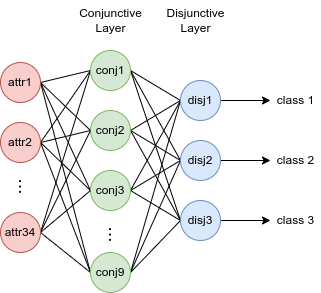

# Neuro-symbolic Rule Learning with neural DNF models in TMC dataset/subsets

This repository contains the source code for multi-label classification
experiments in TMC[1] dataset/subsets, accompanied the paper
"Neuro-symbolic Rule Learning in Real-world Classification Tasks".
Our neural DNF-based models are built upon
[pix2rule](https://github.com/nuric/pix2rule)[2]'s semi-symbolic layers.

Check out sibling repo: [Neuro-symbolic rule learning with neural DNF-based
models in CUB dataset/subsets](https://github.com/kittykg/neural-dnf-cub)

## Project structure

**Directories**

* `conf/`: contains hydra config for running experiments.

* `scripts/`: some useful bash scripts for running data pre-processing and
generating FastLAS[3] examples. The scripts rely their corresponding python
scripts described below.

* `synthetic_test`: contains the synthetic multi-label classification tasks, as
well as a unit test for our implementation of semi-symbolic layers.

**Modules**

* `analysis.py`: contains various `Meter` classes for different metrics.

* `common.py`, `dataset.py`, and `utils.py`: common reusable classes/functions
for experiments.

* `dnf_layer.py`: implementation of pix2rule's semi-symbolic layer.

* `dnf_post_train.py`: post-training processes for symbolic rule
extraction.

* `eval.py`: evaluation methods for vanilla neural DNF and ASP rules.

* `rule_learner.py`: the full vanilla neural DNF model.

* `train.py`: contains the base `Trainer` class for training a neural DNF-based
model.

**Python scripts**

* `arff_parse.py`: arff parsing of TMC dataset.

* `data_preprocess.py`: data pre-processing script for TMC dataset, also used
for generating subsets. The data pre-processing is based on Mutual Information
(MI). We calculate the MI of an attribute with respect of the label combination.
For the math please refer back to Appendix A.2 in the paper.

* `full_pipeline_dnf.py`: full pipeline of training a vanilla neural model and
post-training processing.

* `las_gen.py`: script for generating FastLAS learning example and mode biases.

* `mlp_baseline.py`: full pipeline of training and evaluation of MLP.

* `run_post_train.py`: post-training process of a vanilla neural DNF model.

* `run_train.py`: training process of a vanilla neural DNF model.

## Models

Our neural DNF-based models are created with pix2rule's semi-symbolic layers.

The **vanilla neural DNF model** is identical to pix2rule. This is suitable for
multi-label classification because of the independence between each target
label.



## Requirements

**Base python version**: >= 3.10

**Dataset**: TMC2007-500 - download:
[link](https://www.uco.es/kdis/mllresources/)

**Libraries**: 

* [Pytorch](https://pytorch.org/) version >= 1.11.0 - machine learning framework

* [Hydra](https://hydra.cc/) version >= 1.2 - config management framework

* [Clingo](https://potassco.org/clingo/) - ASP solver

* [scikit-learn](https://scikit-learn.org/stable/index.html) - metrics &
decision tree

**Optional requirements**:

* [FastLAS](https://github.com/spike-imperial/FastLAS/releases) - for symbolic
learning from ASP. Our neural DNF-EO model does not require FastLAS.

## Running instructions

**Data pre-processing**

To reproduce our experiments, you will first need to pre-process the data and
create TMC subsets. Go to `scripts/` and we have more instructions there.

**Vanilla neural DNF model**

To run the full training pipeline for vanilla neural DNF model, edit the configs
in `conf/` (for more information on how to manage hydra config, refer to their
[documentation](https://hydra.cc/docs/intro/)).

In particular, the important yaml files need to be edited are:

* `conf/model/config.yaml`: for changing model architectural design.

* `conf/training/dnf_vanilla.yaml`: training config for the vanilla neural DNF
experiment.

* `conf/environment/[name].yaml`: paths for the pkl files.

Once you setup the configs, you can run the following command:

```
python full_pipeline_dnf.py [hydra config overwrites]
```

**MLP**

To run the training pipeline for MLP baseline, edit the training configs in the
`mlp_baseline.py` script, and you still need `conf/environment/` set up. Once
ready, run the following command:

```
python mlp_baseline.py [hydra config overwrites]
```

## References

[1] [Ashok Srivastava et al., Discovering recurring anomalies in text reports regarding complex space systems](https://ieeexplore.ieee.org/document/1559692)

[2] [Nuri Cingillioglu et al., pix2rule: End-to-end Neuro-symbolic Rule Learning.](https://arxiv.org/abs/2106.07487)

[3] [Mark Law et al., FastLAS: Scalable Inductive Logic Programming Incorporating Domain-Specific Optimisation Criteria](https://ojs.aaai.org/index.php/AAAI/article/view/5678)
